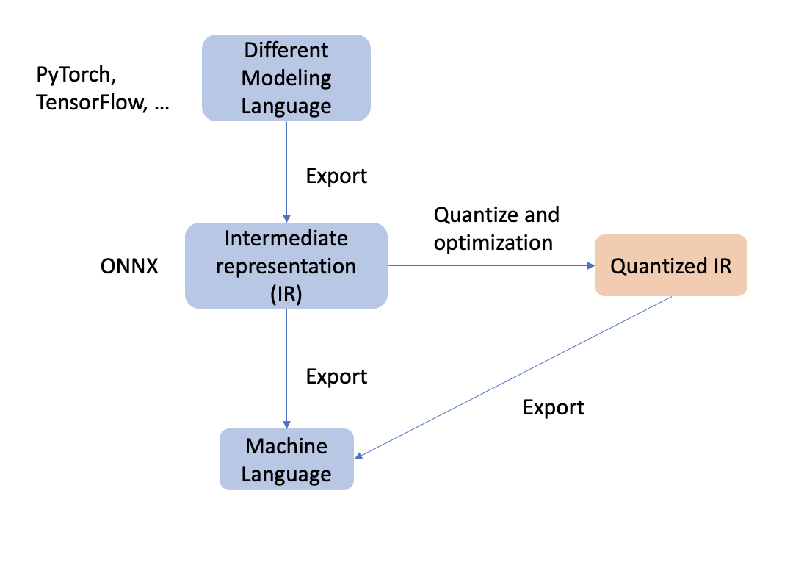

# PTQ2TheMoon_VisionTransformer
## Description
The package for Posting training quantization on Vision Transformer, based on Sense time's framework for quantization:ppq  
Just run example.py to start the quantization pipeline  
## Tool Version
onnx 1.14.0  
torch 2.0.1  
protobuf 3.20.3  
## Diagram  
The diagram for implementing the ppq framework on quantization

### Graph fusion for quantized model  
Graph fusion refers to the merging of multiple computational operators into one larger computational operator. The main purpose of graph fusion is to reduce the overhead of computation and memory access to improve the inference speed and resource utilization of quantized models.
