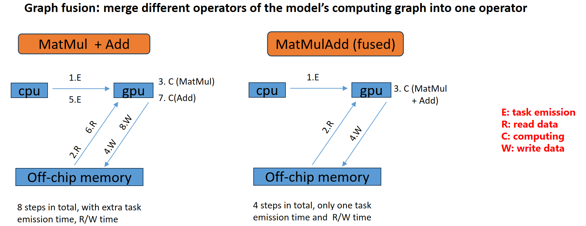
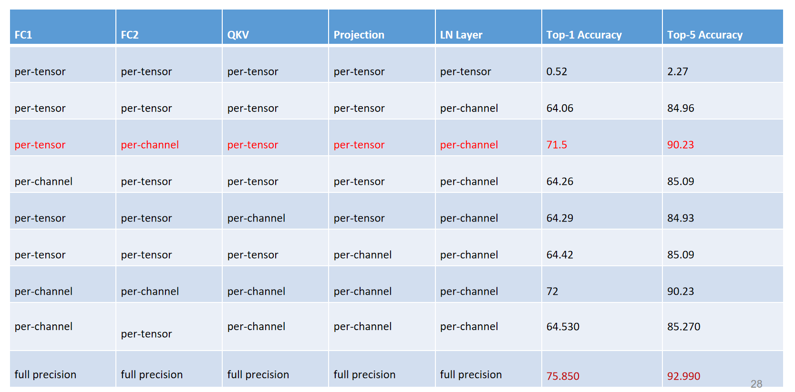
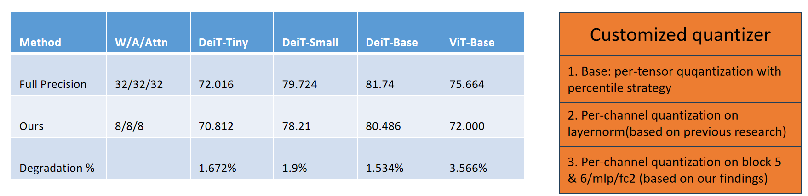
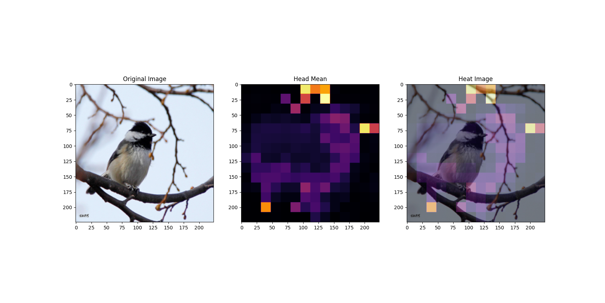
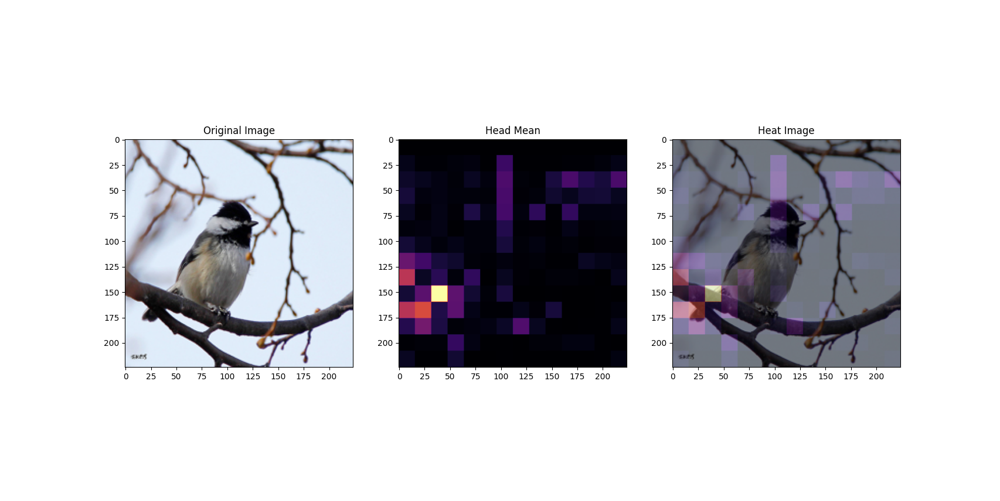
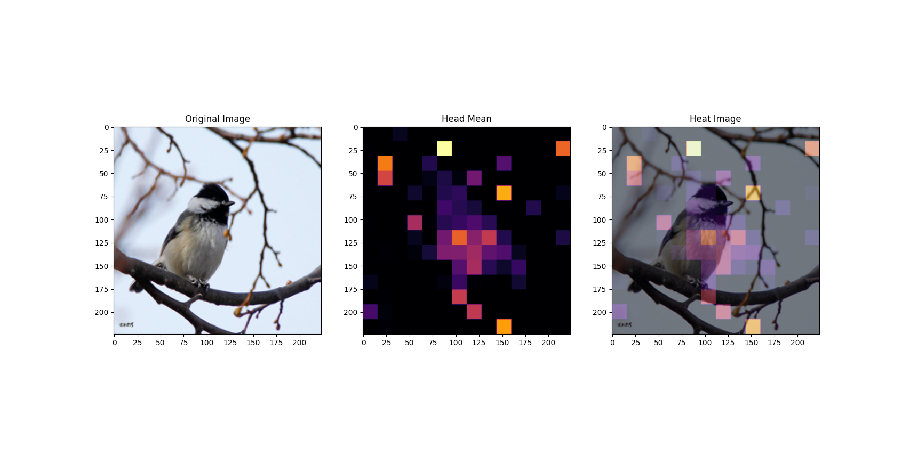

# PTQ2TheMoon_VisionTransformer
## Description
The package for Posting training quantization on Vision Transformer, based on Sense time's framework for quantization:ppq  
Just run example.py to start the quantization pipeline  
## Tool Version
onnx 1.14.0  
torch 2.0.1  
protobuf 3.20.3  
## Diagram  
The diagram for implementing the ppq framework on quantization

## Graph fusion for quantized model  
Graph fusion refers to the merging of multiple computational operators into one larger computational operator. The main purpose of graph fusion is to reduce the overhead of computation and memory access to improve the inference speed and resource utilization of quantized models.  

**Fused Operators**
Fused Operators | Base Operators
---- | ----
LayerNorm | ReduceMean(1) --- Sub(2) --- Pow(3) --- ReduceMean(4) --- Add(5) --- Sqrt(6) --- Div(7) --- Mul(8) --- (Add)(9)
Gelu | Div(1) --- Erf(2)--- Add(3) --- Mul(4) --- Mul(5)
PPQBiasFusedMatMul (MatMulAdd) | MatMul(1) --- Add(2)  

  

## Properties for vanilla quantizers
Num of bits | Quant max value  | Quant min vlaue | Obeserver algorithm | Policy | Rounding Principle
 ---- | ----- | ------ | ------- | -------- | ---------
8  | 127 | -128 | 'percentile' for per-tensor | per-tensor & linear & symmetric | round half even

## Performing Channel-wise quantization on different blocks of Vision Transformer
  

## Result of customized quantizer
An interesting finding is that FC2 of Block 5 and Block 6 seem to have the largest per-tensor SNR error, while we have shown that some channels of FC2 in Block 5 and Block 6 have the largest channel range value among all situations. Therefore, we can think that the maximum channel range value will have a serious impact on quantization when it rises to a certain extent. In addition, this could happen because unlike other operators, FC2 inputs have a high dimensional feature activated by GELU. The dimension of the feature vector in the MLP block in ViT corresponds to the channels of the image feature, which may cause the channel range value of the FC2 activation value to be different (larger) from other fused MatMul operators.

## Attention map visionlization
Full precision model

Vanilla Quantizer

Customized Channel-wise Quantizer

## Reference of papers or online-resource covered during research
* Bahdanau, D., Cho, K., & Bengio, Y. (2014). Neural Machine Translation by Jointly Learning to Align and Translate. CoRR, abs/1409.0473. 
* Brown, T. B., Mann, B., Ryder, N., Subbiah, M., Kaplan, J., Dhariwal, P., Neelakantan, A., Shyam, P., Sastry, G., Askell, A., Agarwal, S., Herbert-Voss, A., Krueger, G., Henighan, T. J., Child, R., Ramesh, A., Ziegler, D. M., Wu, J., Winter, C., . . . Amodei, D. (2020). Language Models are Few-Shot Learners. ArXiv, abs/2005.14165. 
* Chen, H., Wang, Y., Xu, C., Yang, Z., Liu, C., Shi, B., Xu, C., Xu, C., & Tian, Q. (2019). Data-Free Learning of Student Networks. 2019 IEEE/CVF International Conference on Computer Vision (ICCV), 3513-3521. 
* Cubuk, E. D., Zoph, B., Mané, D., Vasudevan, V., & Le, Q. V. (2018). AutoAugment: Learning Augmentation Policies from Data. ArXiv, abs/1805.09501. 
* Cubuk, E. D., Zoph, B., Shlens, J., & Le, Q. V. (2019). Randaugment: Practical automated data augmentation with a reduced search space. 2020 IEEE/CVF Conference on Computer Vision and Pattern Recognition Workshops (CVPRW), 3008-3017. 
* Devlin, J., Chang, M.-W., Lee, K., & Toutanova, K. (2019). BERT: Pre-training of Deep Bidirectional Transformers for Language Understanding. ArXiv, abs/1810.04805. 
* Dosovitskiy, A., Beyer, L., Kolesnikov, A., Weissenborn, D., Zhai, X., Unterthiner, T., Dehghani, M., Minderer, M., Heigold, G., Gelly, S., Uszkoreit, J., & Houlsby, N. (2020). An Image is Worth 16x16 Words: Transformers for Image Recognition at Scale. ArXiv,abs/2010.11929. 
* Frumkin, N., Gope, D., & Marculescu, D. (2022). CPT-V: A Contrastive Approach to PostTraining Quantization of Vision Transformers. ArXiv, abs/2211.09643. 
* Gholami, A., Kim, S., Dong, Z., Yao, Z., Mahoney, M. W., & Keutzer, K. (2021). A Survey of Quantization Methods for Efficient Neural Network Inference. ArXiv, abs/2103.13630. 
* Gholami, A., Mahoney, M. W., & Keutzer, K. (2020). An integrated approach to neural network design, training, and inference. Univ. California, Berkeley, Berkeley, CA, USA, Tech. Rep. 
* Gray, R. M., & Neuhoff, D. L. (1998). Quantization. IEEE Transactions on Information Theory,44(6), 2325-2383. https://doi.org/10.1109/18.720541
* Kim, Y., Denton, C., Hoang, L., & Rush, A. M. (2017). Structured Attention Networks. ArXiv,abs/1702.00887. 
* Li, Z., Chen, M., Xiao, J., & Gu, Q. (2022). PSAQ-ViT V2: Towards Accurate and General Data-Free Quantization for Vision Transformers. ArXiv, abs/2209.05687. 
* Li, Z., Ma, L., Chen, M., Xiao, J., & Gu, Q. (2022). Patch Similarity Aware Data-Free Quantization for Vision Transformers. ArXiv, abs/2203.02250. 
* Li, Z., Xiao, J., Yang, L., & Gu, Q. (2022). RepQ-ViT: Scale Reparameterization for PostTraining Quantization of Vision Transformers. ArXiv, abs/2212.08254. 
* Lin, Y., Zhang, T., Sun, P., Li, Z., & Zhou, S. (2021). FQ-ViT: Post-Training Quantization for Fully Quantized Vision Transformer. International Joint Conference on Artificial Intelligence
* Liu, Y., Yang, H., Dong, Z., Keutzer, K., Du, L., & Zhang, S. (2022). NoisyQuant: Noisy BiasEnhanced Post-Training Activation Quantization for Vision Transformers. ArXiv,abs/2211.16056. 
* Liu, Z., Hu, H., Lin, Y., Yao, Z., Xie, Z., Wei, Y., Ning, J., Cao, Y., Zhang, Z., Dong, L., Wei, F., & Guo, B. (2021). Swin Transformer V2: Scaling Up Capacity and Resolution. 2022 IEEE/CVF Conference on Computer Vision and Pattern Recognition (CVPR), 11999-12009. 
* Liu, Z., Wang, Y., Han, K., Ma, S., & Gao, W. (2021). Post-Training Quantization for Vision Transformer. Neural Information Processing Systems, 
* Mehta, S., & Rastegari, M. (2021). MobileViT: Light-weight, General-purpose, and Mobilefriendly Vision Transformer. ArXiv, abs/2110.02178
* Nagel, M., Amjad, R. A., Baalen, M. v., Louizos, C., & Blankevoort, T. (2020). Up or Down? Adaptive Rounding for Post-Training Quantization. ArXiv, abs/2004.10568.
* Nagel, M., Fournarakis, M., Amjad, R. A., Bondarenko, Y., Baalen, M. v., & Blankevoort, T. (2021). A White Paper on Neural Network Quantization. ArXiv, abs/2106.08295.
* Przewlocka-Rus, D., Sarwar, S. S., Sumbul, H. E., Li, Y., & Salvo, B. d. (2022). Power-of-Two Quantization for Low Bitwidth and Hardware Compliant Neural Networks. ArXiv,abs/2203.05025.
* Radosavovic, I., Kosaraju, R. P., Girshick, R. B., He, K., & Dollár, P. (2020). Designing Network Design Spaces. 2020 IEEE/CVF Conference on Computer Vision and Pattern Recognition (CVPR), 10425-10433.
* SenseTime. (2023). PPL Quantization Tool GitHub repository. https://github.com/openpplpublic/ppq
* Touvron, H., Cord, M., Douze, M., Massa, F., Sablayrolles, A., & J'egou, H. e. (2020). Training data-efficient image transformers & distillation through attention. International Conference on Machine Learning
* Vaswani, A., Shazeer, N., Parmar, N., Uszkoreit, J., Jones, L., Gomez, A. N., Kaiser, L. u., & Polosukhin, I. (2017). Attention is All you Need https://proceedings.neurips.cc/paper/2017/file/3f5ee243547dee91fbd053c1c4a845aa-Paper.pdf
* Wightman, R. (2019). PyTorch Image Models. GitHub repository. https://doi.org/10.5281/zenodo.4414861
* Wu, H., Judd, P., Zhang, X., Isaev, M., & Micikevicius, P. (2020). Integer Quantization for Deep Learning Inference: Principles and Empirical Evaluation.
* Xiao, T., Singh, M., Mintun, E., Darrell, T., Dollár, P., & Girshick, R. B. (2021). Early Convolutions Help Transformers See Better. Neural Information Processing Systems
* Yuan, Z., Xue, C., Chen, Y., Wu, Q., & Sun, G. (2022). PTQ4ViT: Post-Training Quantization For Vision Transformers With Twin Uniform Quantization Computer Vision – ECCV 2022: 17th European Conference, Tel Aviv, Israel, October 23–27, 2022, Proceedings, Part XII, https://doi.org/10.1007/978-3-031-19775-8_12
* Zhao, R., Hu, Y., Dotzel, J., Sa, C. D., & Zhang, Z. (2019). Improving Neural Network Quantization without Retraining using Outlier Channel Splitting. ArXiv, abs/1901.09504

